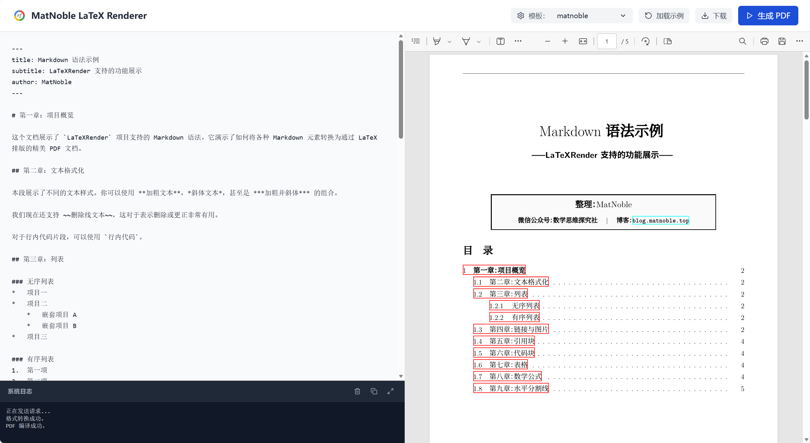

# Markdown to LaTeX Converter

[English](README.md) | [简体中文](README_ZH.md)



This project provides a utility to convert Markdown files, especially those containing mathematical expressions, into LaTeX documents. It's designed for academic or technical writing where LaTeX is preferred for its typesetting quality.

## 🔒 Privacy & Security First

**Your data never leaves your machine.** 

We intentionally designed this as a **local-first/self-hosted** tool rather than a public web service. We believe that academic papers, technical reports, and personal notes are private. By running this tool locally via Docker or Python, you ensure:
*   **Complete Data Privacy:** No document content is ever uploaded to a third-party server.
*   **Zero Tracking:** We don't collect any information about what you are writing.
*   **Offline Capability:** Work anywhere without needing an internet connection.

## Project Structure

The project follows a standardized structure:

```
.
├── latexrender/          # Core source code package
│   ├── main.py           # CLI entry point & core logic
│   ├── renderer.py       # Custom Mistune LaTeX renderer
│   └── templates.py      # LaTeX templates
├── server/               # FastAPI backend for GUI
│   └── main.py           # API endpoints & static file hosting
├── web/                  # React frontend source code
│   ├── src/              # React components
│   ├── dist/             # Compiled static assets (generated after build)
│   └── package.json      # Frontend dependencies
├── doc/                  # Documentation, assets, and templates
│   ├── matnoble.cls      # Standard student note template
│   ├── matnoble-teaching.cls # Teaching plan template
│   └── ...               # Assets (logos) & generated output
├── tests/                # Unit tests
├── start_app.py          # All-in-one GUI launcher script
├── setup.py              # Package installation config
├── Dockerfile            # Docker image configuration
├── docker-compose.yml    # Docker container orchestration
├── .dockerignore         # Files to ignore during Docker build
├── .gitignore            # Git ignore file
└── README.md             # Project documentation
```

## Prerequisites

*   **Docker (Highly Recommended):** Docker Desktop (Windows/Mac) or Docker Engine (Linux). This is the easiest way to manage LaTeX environments.
*   **LaTeX Distribution (Local):** A full distribution like [TeX Live](https://www.tug.org/texlive/) or [MiKTeX](https://miktex.org/) (Required only if not using Docker).
*   **Python:** Python 3.8 or higher.
*   **Node.js (Optional):** Required only if you want to modify and rebuild the frontend web interface.

## Installation & Deployment

### 1. Docker Mode (Easiest & Consistent)

Use Docker to run the application without installing LaTeX or Python packages locally.

```bash
# Start the application using Docker Compose
docker-compose up -d --build
```
- **Rebuild & Cleanup:** To avoid accumulating dangling images (`<none>:<none>`) during development, you can use the provided script:
  ```bash
  chmod +x redeploy.sh
  ./redeploy.sh
  ```
- **Port:** The GUI will be available at `http://localhost:8000`.
- **Fonts:** Built-in support for **Source Han Serif/Sans (Noto CJK)**. To add custom fonts, place them in a `fonts/` directory and uncomment the volume mapping in `docker-compose.yml`.
- **Persistence:** Generated PDFs are synced to your local `build/` folder.

### 2. Local Mode (Manual Setup)

#### Step A: Setup Python Environment
```bash
conda create -n lxrender python=3.9 -y
conda activate lxrender
pip install -e .
```

#### Step B: Build Frontend (First time only)
```bash
cd web
npm install
npm run build
cd ..
```

## Usage

### 1. GUI Mode (Web Interface)

If running locally:
```bash
python start_app.py
```
If running via Docker:
Simply visit `http://localhost:8000`.

### 2. CLI Command (`lxrender`)

```bash
# Basic conversion
lxrender input.md

# Use teaching plan template
lxrender input.md --template matnoble-teaching

# Convert and compile to PDF
lxrender input.md --compile --clean
```

## Feature Support

*   **Templates:** 
    *   `matnoble`: Standard math notes with author card.
    *   `matnoble-teaching`: Official teaching plan with info table and **grid background**.
*   **Docker Optimized:** Pre-configured XeTeX environment with multi-stage build.
*   **Math:** Full support for Inline math `$E=mc^2$` and Block math `$$...$$`.
*   **Cleanup:** Automated auxiliary file removal via `latexmk -c`.

## Testing

```bash
python -m unittest discover tests
```